```{r setup, include=FALSE}

packages <- c(
  "knitr",
  "kableExtra",
  "dplyr",
  "ggplot2",
  "patchwork"
)

# Installer les packages manquants
installed <- packages %in% rownames(installed.packages())
if (any(!installed)) {
  install.packages(packages[!installed])
}

# Charger les packages
invisible(lapply(packages, library, character.only = TRUE))

```

# Introduction

{.full-image-discussion}

## Contexte socio-technique de la désinformation visuelle

Depuis les années 2000, l’essor des réseaux sociaux a transformé la circulation de l’information. Des plateformes comme X (anciennement Twitter) permettent une diffusion quasi instantanée auprès de millions d’utilisateurs [@RUFFO2023100531].

::: {data-id="context-box"}

- **Facilitation de l'accès** : Diffusion rapide et globale
- **Risques** : Propagation de contenus falsifiés ou manipulés
- **Influence algorithmique** : Mécanismes de recommandation favorisant la viralité
- **Impact sociétal** : Effets sur débats publics et processus électoraux

:::

## Cas d'étude : "C'est Nicolas qui paie" sur X

L’expression « C’est Nicolas qui paie » est apparue début 2025 sur X, incarnant un personnage fictif de contribuable français exaspéré par la fiscalité.

::: {data-id="case-study-box"}

- **Propagation rapide** : Reprise par des comptes d'extrême droite
- **Résonance politique** : Débat à l'Assemblée nationale
- **Questionnement** : Diffusion organique ou coordonnée inauthentique ?

:::

Cette étude vise à caractériser les mécanismes de diffusion des images associées à ce syntagme.

## Objectifs de recherche


**Objectif principal** : Détecter la diffusion inauthentique d'images liées au syntagme "C'est Nicolas qui paie" sur X.

**Objectifs secondaires** :

• Analyser la coordination temporelle et visuelle des publications

• Identifier l'amplification artificielle via métriques d'engagement

• Détecter les opérations structurées au sein de communautés d'utilisateurs

{.reduced-image}

## Hypothèses de recherche

- **H1** : La diffusion présente des schémas temporels non aléatoires révélant des comportements coordonnés.
- **H2** : Certaines images visuellement similaires ont bénéficié d'une amplification artificielle.
- **H3** : La propagation s'organise autour de communautés distinctes, avec des mécanismes propres à chaque groupe.

# Méthodologie appliquée{.center}

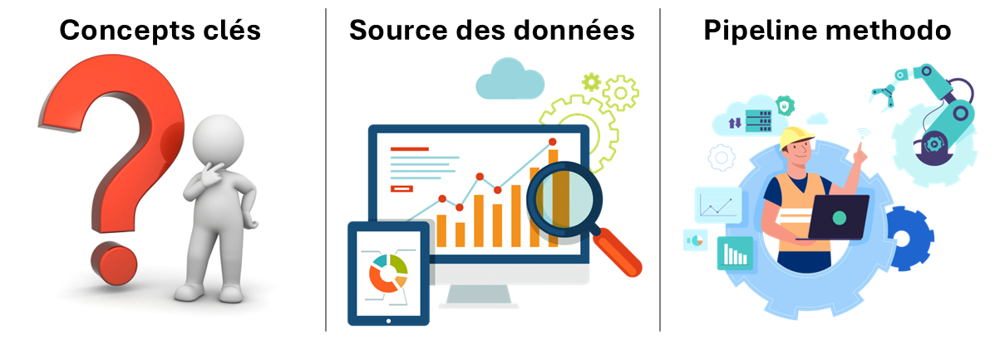{.full-image}


## Définition des concepts opérationnels

- **Diffusion d’une image** : Actions assurant sa circulation, sa visibilité et sa réactivation dans l’espace informationnel.
- **Coordination** : Actions synchronisées par plusieurs acteurs, potentiellement sans intention trompeuse [@Nizzoli_Tardelli_Avvenuti_Cresci_Tesconi_2021].
- **Amplification** : Propagation rapide et engagée de contenus similaires [@wohlert2025detecting].
- **Opérations structurées** : Campagnes coordonnées au sein de groupes [@wohlert2025detecting].
- **Inauthenticité** : Comportements manipulateurs ou trompeurs.

## Collecte et description des données

- **Période** : Janvier à novembre 2025
- **Requête** : *Nicolas qui paie [nicolasquipaie OR #nicolasquipaie OR "nicolas qui paie" OR juliequipaie...]*
- **Volume** : 217 580 tweets, 43 779 comptes uniques, 26 148 images (5 731 dupliquées)
- **Variables** : Utilisateur, image, timestamp, métriques d'engagement

{.reduced-image}

## Pipeline méthodologique intégré (1/3)

- **Détection des doublons et vectorisation (CLIP)**

```{r work-pipeline-1, fig.align='center', fig.cap="Pipeline méthodologique pour la détection de coordination dans la diffusion d'images sur X - Etape 1", out.width="100%", out.height="100%", echo=FALSE}
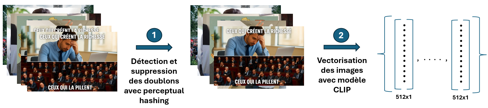
```

<div class="keywords-overlay">
<span class="keyword-badge">Prétraitement des images</span>
<span class="keyword-badge">Perceptual hashing $\Rightarrow$ : Détection de doublons</span>
<span class="keyword-badge">Modèle CLIP $\Rightarrow$ : Vectorisation des images</span>
</div>

## Pipeline méthodologique intégré (2/3)

- **Clustering visuel & sémantique (UMAP & HDBSCAN)**

```{r work-pipeline-2, fig.align='center', fig.cap="Pipeline méthodologique pour la détection de coordination dans la diffusion d'images sur X - Etape 2", out.width="100%", out.height="85%", echo=FALSE}
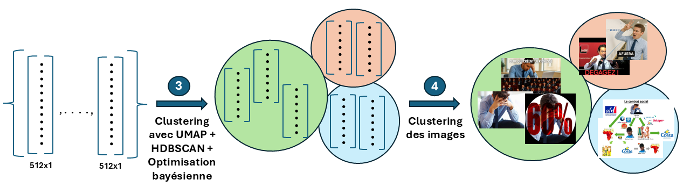
```


<div class="keywords-overlay">
<span class="keyword-badge">UMAP $\Rightarrow$ Réduction de dimension</span>
<span class="keyword-badge">HDBSCAN $\Rightarrow$ Clustering des images</span>
<span class="keyword-badge">Bayesian Opt $\Rightarrow$ Tunning des paramètres</span>
</div>

## Pipeline méthodologique intégré (3/3)

- **Réseaux & validation statistique**

```{r work-pipeline-3, fig.align='center', fig.cap="Pipeline méthodologique pour la détection de coordination dans la diffusion d'images sur X - Etape 3", out.width="100%", out.height="85%", echo=FALSE}
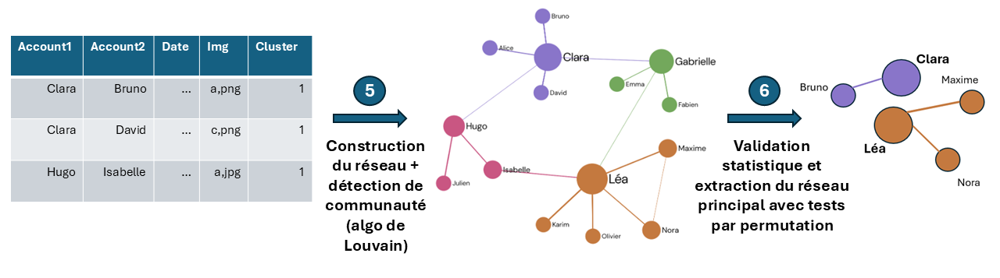
```


<div class="keywords-overlay">
<span class="keyword-badge">Poids : $W_{uv}^{(c^*)} = \sum_{i \in I_{c^*}} e^{-\lambda \Delta t_{uv,i}}$ ; Graphe pondéré : $G_{c^*} = (U_{c^*}, E_{c^*}, W^{(c^*)})$</span>
<span class="keyword-badge">Algo de Louvain</span>
<span class="keyword-badge">Tests par permutation</span>
</div>

# Résultats

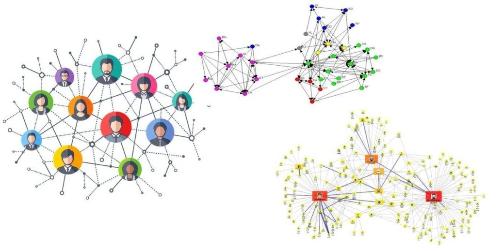{.full-image}

## Structuration thématique des clusters d'images

```{r stat-desc, fig.align='center', fig.cap="Métriques descriptives globales : clusters, engagement et temporalité", out.width="100%", out.height="100%", echo=FALSE}
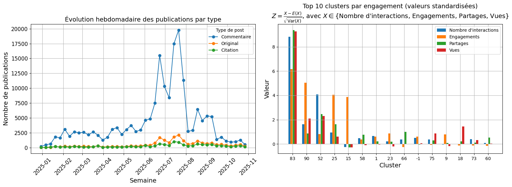
```

<div class="keywords-overlay">
<span class="keyword-badge">Pics d'activité mi-juin à mi-juillet</span>
<span class="keyword-badge">Clustering CLIP + UMAP + HDBSCAN</span>
<span class="keyword-badge">105 clusters identifiés</span>
</div>

## Typologie thématique des clusters

| **Thèmes** | **Description** | **Nombre de clusters** |
|------------|-----------------|------------------------|
| Narratifs politiques | Messages idéologiques, slogans | 15 dont les cluster 1 et 79 |
| Acteurs politiques | Personnalités, institutions | 13 |
| Memes et détournements | Humour, IA générative | 16 dont le cluster 62 |
| Captures d'écran | Tweets, articles | 21 |
| Symboles quotidiens | Objets, lieux culturels | 41 |

: Typologie des clusters d'images identifiés

## Illustration de clusters représentatifs

```{r img-clusters, fig.align='center', fig.cap="Exemples de clusters : cohérence visuelle et sémantique", out.width="150%", out.height="150%", echo=FALSE}
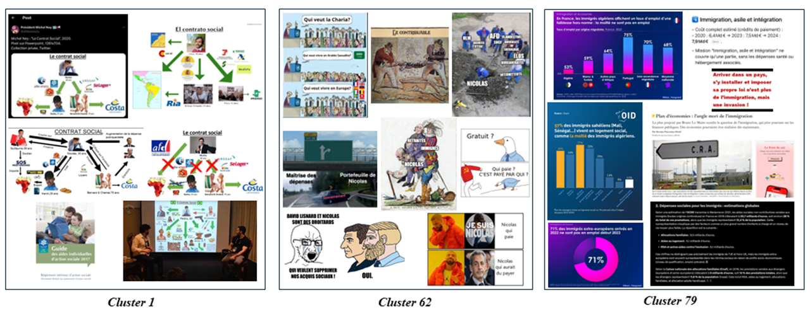
```

<div class="keywords-overlay">
<span class="keyword-badge">Cohérence visuelle et sémantique</span>
<span class="keyword-badge">Thématisation (Nicolas, Memes, Immigration)</span>
<span class="keyword-badge">Variabilité intra-cluster</span>
</div>


## Dynamiques d'interactions entre comptes

```{r, echo=FALSE, warning=FALSE, message=FALSE}
library(dplyr)
library(ggplot2)
nicolasquipaie_data = read.csv(file = "data/nicolasquipaie_data_filter.csv")

# Choisissons les comptes avec au moins 10 posts sur la période
pf_filter <- nicolasquipaie_data %>% group_by(pf_account_id) %>% summarise(
  count = n()
) %>% filter(count >= 10) %>% .[["pf_account_id"]]

nicolasquipaie_data <- nicolasquipaie_data %>% filter(pf_account_id %in% pf_filter) %>%
  mutate(
    post_created_at = as.POSIXct(post_created_at),
    source_date = as.POSIXct(source_date)
  )

nicolasquipaie_data$source_pf_account_id = ifelse(nicolasquipaie_data$source_pf_account_id == "1712592197160194048",
                                                  "nicolasquipaie", nicolasquipaie_data$source_pf_account_id)

nicolasquipaie_data <- nicolasquipaie_data %>%
  mutate(pf_account_id = factor(pf_account_id),
         source_pf_account_id = factor(source_pf_account_id))

# Filtre
start_date <- as.POSIXct("2025-01-31 00:00:00")
end_date   <- as.POSIXct("2025-07-31 00:00:00")

nicolasquipaie_data1 <- nicolasquipaie_data %>%
filter((source_date >= start_date & source_date <= end_date) &
         (post_created_at >= start_date & post_created_at <= end_date))

graph1 <- ggplot(nicolasquipaie_data1,
       aes(x = post_created_at,
           y = pf_account_id)) +
  geom_point(size = 1) +                        # points aux instants de publication
  geom_line(aes(group = pf_account_id)) +      # ligne horizontale par compte
  geom_line(aes(x = source_date,
           y = source_pf_account_id),
           color = 'red')+
  geom_point(aes(x = source_date,
           y = source_pf_account_id),
           color = 'red', size = 1)+
  labs(
    subtitle =  "Janvier - Juillet",
    x = "",
    y = "Compte"
  ) +
  theme_light() +
  theme(
    axis.text.x = element_text(size = 12, angle = 45, hjust = 1),
    axis.text.y = element_text(size = 10),
    axis.title.x = element_text(size = 12),
    axis.title.y = element_text(size = 12)
  )
```

```{r, echo=FALSE, warning=FALSE, message=FALSE}
# Filtre
# start_date <- as.POSIXct("2025-06-30 00:00:00")
# end_date   <- as.POSIXct("2025-09-30 00:00:00")
#
# nicolasquipaie_data2 <- nicolasquipaie_data %>%
# filter((source_date >= start_date & source_date <= end_date) &
#          (post_created_at >= start_date & post_created_at <= end_date)) %>%
#   mutate(
#     pf_account_id = factor(pf_account_id, levels = names(sort(table(pf_account_id), decreasing = TRUE))),
#     source_pf_account_id = factor(source_pf_account_id, levels = levels(pf_account_id))
#   )
#
# graph2 <- ggplot(nicolasquipaie_data2,
#        aes(x = post_created_at,
#            y = pf_account_id)) +
#   geom_point(size = 1) +                        # points aux instants de publication
#   geom_line(aes(group = pf_account_id)) +      # ligne horizontale par compte
#   geom_line(aes(x = source_date,
#            y = source_pf_account_id),
#            color = 'red')+
#   geom_point(aes(x = source_date,
#            y = source_pf_account_id),
#            color = 'red', size = 1)+
#   labs(
#     title = "",
#     subtitle =  "Juin - Septembre",
#     x = "Date de publication",
#     y = "Compte"
#   ) +
#   theme_light() +
#   theme(
#     axis.text.x = element_text(size = 12, angle = 45, hjust = 1),
#     axis.text.y = element_text(size = 10),
#     axis.title.x = element_text(size = 12),
#     axis.title.y = element_text(size = 12)
#   )
```

```{r, echo=FALSE, warning=FALSE, message=FALSE, fig.align='center', out.height="80%", out.width="80%", fig.show='hold', fig.pos='H', fig.width=11, fig.height=6, fig.margin = 0}
#| label: react-le-lus
#| fig-cap: Réactions des comptes au post source de nicolasquipaie

#library(patchwork)
# --- Combiner avec patchwork (empile verticalement) ---
#combined_plot <- graph1/graph2

# Afficher le graphique
#combined_plot
graph1
```

<div class="keywords-overlay">
<span class="keyword-badge">Proximité temporelle récurrente</span>
<span class="keyword-badge">Amplificateurs actifs</span>
<span class="keyword-badge">Phases d'intensification</span>
<span class="keyword-badge">Diffusion coordonnée ?</span>
</div>


## Cluster 01 : Structure du réseau des comptes

::: {.columns}

::: {.column width="70%"}

```{r, echo=FALSE, warning=FALSE, message=FALSE, fig.align='center', out.width="90%", out.height="60%", fig.show='hold', fig.pos='H', fig.align='center'}
#| label: reseau-c0-lambda-03
#| fig-cap: Graphe de réseau des comptes ayant publié les images du cluster 1 (HDBSCAN), pondéré par la proximité temporelle et l’intensité des interactions entre les comptes reposteurs (λ = 0,3)
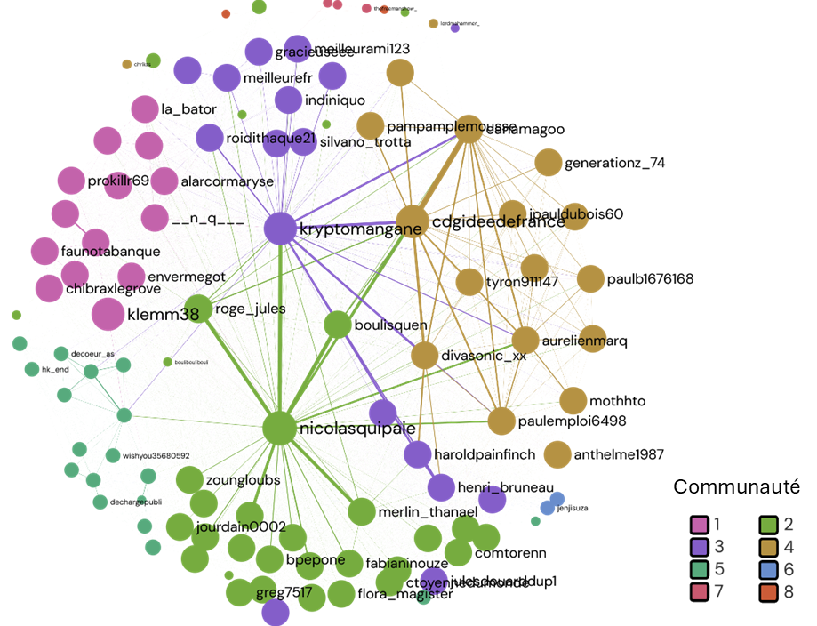
```

:::

::: {.column width="30%"}

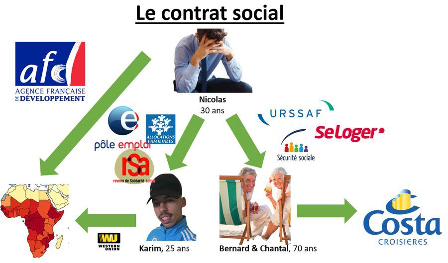{style="margin-bottom: 0px;" width=70%}

<div style="font-size:18px;">
<ul>
<li>Structure dense : 107 comptes reliés par 2789 liens</li>
<li>Contrainte temporelle ↑ → communautés plus distinctes</li>
<li>Communautés autour de *nicolasquipaie*, *kryptomangane* et *cdgideedefrance*</li>
<li>Connexions fortes entre hubs</li>
<li>**Coordination inter-communautés probable**</li>
</ul>
</div>

:::

:::

<div class="keywords-overlay">
<span class="keyword-badge">Modularité Q=0.17→0.42</span>
<span class="keyword-badge">Communautés distinctes</span>
<span class="keyword-badge">Hub central nicolasquipaie</span>
<span class="keyword-badge">Connexions inter-communautés</span>
</div>


## Cluster 01 : Robustesse de certains noyaux coordonnés

::: {.columns}

::: {.column width="80%"}

```{r, echo=FALSE, warning=FALSE, message=FALSE, fig.align='center', out.width="150%", out.height="150%", fig.show='hold', fig.pos='H', fig.align='center'}
#| label: sensibilite-lambda-c0
#| fig-cap: Persistance des comptes significativement coordonnées en fonction du paramètres de décroissance temporelle
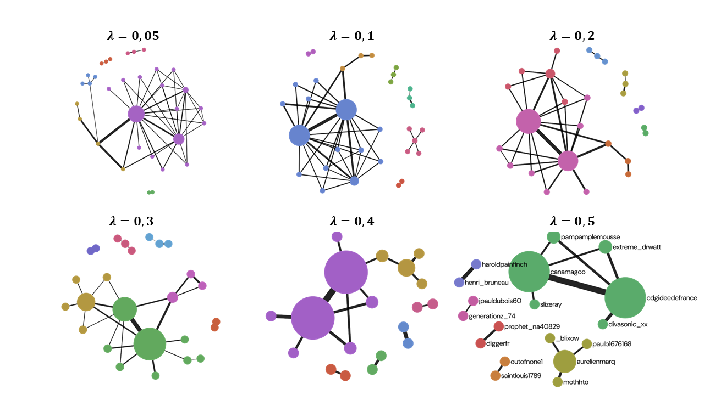
```

:::

::: {.column width="20%"}

<div style="font-size:18px;">
<ul>
<li>Test de permutation appliqué pour chaque λ</li>
<li>λ ↑ → moins de liens significatifs</li>
<li>Seules les interactions très proches persistent</li>
<li>Certains liens restent robustes quel que soit λ</li>
<li>→ Noyaux fortement synchronisés</li>
<li>**Diffusion en deux niveaux : initiation + amplification**</li>
</ul>
</div>

:::

:::

<div class="keywords-overlay">
<span class="keyword-badge">Nicolasquipaie non significatif</span>
<span class="keyword-badge">Production & Amplification $\Rightarrow$ Diffusion deux niveaux</span>
<span class="keyword-badge">Viralité : visibilité + coordination</span>
</div>

## Cluster 62 : Structure du réseau des comptes

::: {.columns}

::: {.column width="85%"}

```{r, fig.align='center', out.width="100%", fig.show='hold', out.height="80%", echo=FALSE}
#| label: network-cluster-62
#| fig-cap: Réseau des comptes qui publient les images du cluster 62 (HDBSCAN)
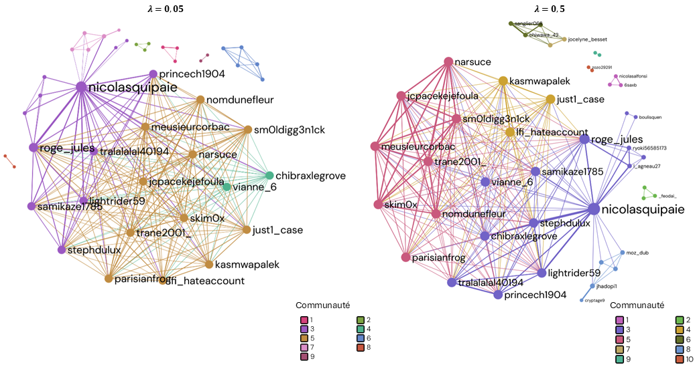
```

<span class="keyword-badge">Modularité augmente avec $\lambda$</span>
<span class="keyword-badge">Clustering élevé & assortativité positive $\Rightarrow$ actions en communautés</span>
<span class="keyword-badge">Diffusion organique</span>

:::

::: {.column width="15%"}

{style="margin-bottom:0px;" width=100%}
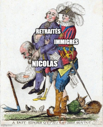{style="margin-bottom: 0px;" width=100%}
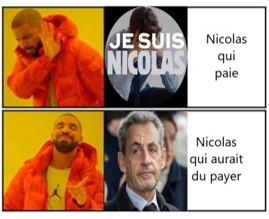{style="margin-bottom: 0px;" width=100%}
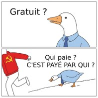{style="margin-bottom: 0px;" width=100%}

:::

:::

## Cluster 62 : Détection de coordinations non significatives selon le paramètre de décroissance temporelle $\lambda$

```{r, echo=FALSE, warning=FALSE, message=FALSE, fig.align='center', out.width="80%", out.height="20%", fig.show='hold', fig.pos='H', fig.align='center'}
#| label: manathan-plots-c0
#| fig-cap: Distribution des p-values ajustées en fonction du paramètre $\lambda$ - Cluster 01
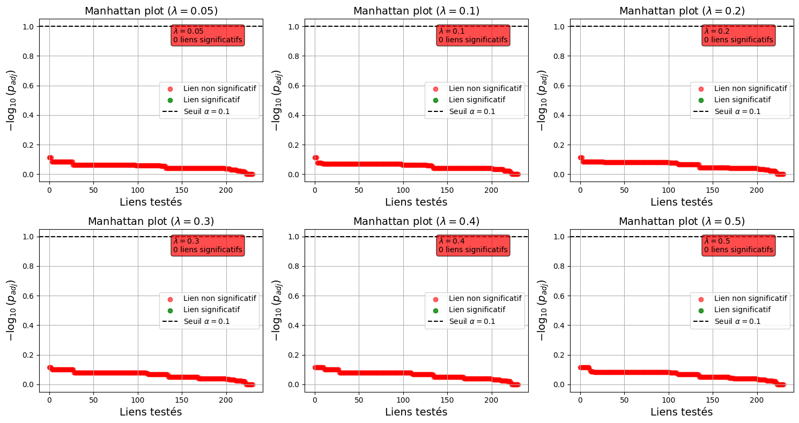
```

<div class="keywords-overlay">
<span class="keyword-badge">Test de permutation (B=2000)</span>
<span class="keyword-badge">Manhattan plots (FDR ≤ 10%)</span>
<span class="keyword-badge">Aucun lien statistiquement significatifs</span>
</div>


# Discussion {.center}

{.full-image-discussion}


## Validation des objectifs et hypothèses

::: {.validation-box}

::: {.columns}

::: {.column width="80%"}

- Coordination temporelle détectée [@Nizzoli_Tardelli_Avvenuti_Cresci_Tesconi_2021]

- Amplification artificielle cohérente avec @wohlert2025detecting

- Communautés distinctes identifiées [@Stella_2018]

Hypothèses :

- H1 : Partiellement validée (coordinations pas toutes significatives)

- H2 : Validée (réutilisation massive, engagement élevé)

- H3 : Validée (structures communautaires nettes)

:::

::: {.column width="20%"}


:::

:::

:::

## Forces méthodologiques

::: {data-id="strengths-box"}

- Approche multimodale : hashing [@SAMANTA2021203], CLIP [@radford2021clip], UMAP [@mcinnes2018umap], HDBSCAN [@Malzer_2020]

- Rigueur statistique : permutations + FDR [@Shuken2021.09.09.459558]

- Réseau inféré : basé sur la similarité temporelle, différent des graphes sociaux explicites [@Stella_2018]

:::

{.reduced-image-2}

## Limites et biais potentiels

::: {data-id="limits-box"}

- Cas d’étude unique : dynamique propre au phénomène observé

- Données partielles : hashtags et chaînes de réponses non exploités [@CINELLI2022113819]

- Biais possible : comptes inactifs ou supprimés, images non collectées

- Interprétation prudente : coordination ≠ inauthenticité (Murero, 2023) [@10.3389/fsoc.2023.1141416]

:::

{.reduced-image-2}

# Conclusion

## Synthèse des apports

::: {data-id="synthesis-box"}

- L’analyse **visuelle–sémantique–temporelle** $\Rightarrow$ schémas de diffusion **non aléatoires**

- **Réseaux** $\Rightarrow$ **communautés structurées** (initiateurs, relais, amplificateurs) & rôles différenciés dans la propagation.

- **Tests de permutation** $\Rightarrow$ plusieurs liens significatifs & **faible densité** du sous‑réseau coordonné ($\Rightarrow$ interprétation prudente).

- **Contributions** : pipeline reproductible pour l’analyse de diffusions visuelles coordonnées
- **Implications** : appui à la modération et à la recherche sur la désinformation

:::

## Perspectives futures

::: {data-id="future-box"}

- **Extensions** : collecte élargie, intégration texte + image
- **Applications** : détection temps réel, analyses inter‑plateformes
- **Recherche** : validation sur d’autres cas, mesure plus fine de l’inauthenticité

{.reduced-image}

:::


## Remerciements

- Encadrants : Erwan LE NAGARD, Brandon SAINTILAN.
- Équipe pédagogique : École ENSAI.
- Outils : R, Python, Quarto.


## Reférences bibliographiques
